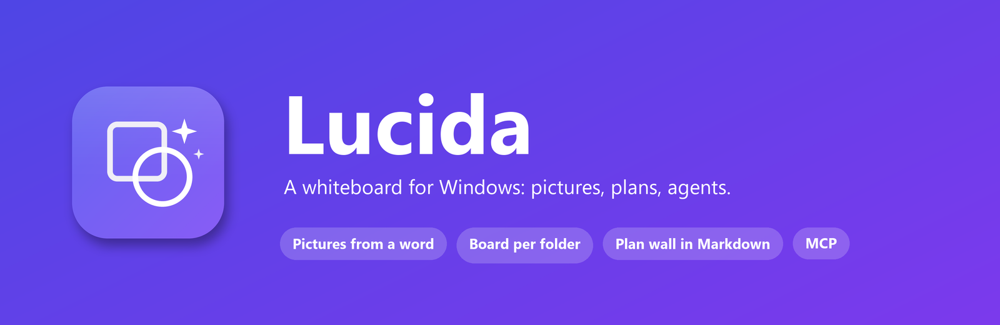

<p align="center">
  
</p>

<p align="center">
  <a href="https://github.com/hanzala-bhutto/lucida/actions/workflows/ci.yml"></a>
  <a href="https://github.com/hanzala-bhutto/lucida/releases/latest"></a>
  <a href="./LICENSE"></a>
  <a href="https://tauri.app"></a>
</p>

**Lucida** is a whiteboard for Windows, built on
[Excalidraw](https://github.com/excalidraw/excalidraw):

- **Write a word, get a picture.** Select it, press **✦ Picture** (or `Ctrl+I`). Click
  the picture to change it, or ↻ to draw it again.
- **One board per folder — as many boards as you have folders.** The board
  lives next to the project, in `<folder>/.lucida/`.
- **A plan wall that is a folder of Markdown files.** Drag a card, pin a person
  to it, pull a red string between two cards — and the files change with it.
  Edit a file, and the wall changes.
- **Agents can draw on it.** An MCP server lets Claude Code (or any MCP client)
  read the board and put proposals on it.

> Lucida for Windows is a fork of [Lucida](https://github.com/Lang-Julian/lucida)
> by [Julian Lang](https://github.com/Lang-Julian), ported to Windows and
> maintained here. See [Credits](#credits).

> Named after the *camera lucida*, the optical drawing aid artists used to trace
> what they saw.

<p align="center">
  
</p>
<p align="center"><sub>The plan wall, drawn from the fictional demo plan (<code>npm run demo</code>). Every card is a Markdown file.</sub></p>

## Install

Download the installer (`Lucida_<version>_x64-setup.exe`) from the
[latest release](https://github.com/hanzala-bhutto/lucida/releases/latest) and run
it. It installs for the current user, into `%LOCALAPPDATA%\Lucida`, and needs
no admin rights. The installer is not code-signed yet, so SmartScreen asks
first: **More info → Run anyway**. An `.msi` for per-machine deployment is
published next to it.

Windows 10 or 11 (x64) with the WebView2 runtime, which Windows 11 ships and
the installer fetches on Windows 10. Pictures need an
[OpenRouter](https://openrouter.ai) key — paste it in the settings (`Ctrl+,`).
Everything else works without one.

Open a folder from the menu (**Open folder …**), or from a terminal:

```bat
scripts\lucida.cmd C:\code\some-repo     :: the board for that project
```

## Pictures

1. Write a word on the board — or sketch something.
2. Select it. A **✦ Picture** chip appears under it; click it (or press `Ctrl+I`).
3. The picture lands under the word, on a transparent background.
4. **Click the picture** to change it: type what should be different ("make it
   night"), Enter. The model gets the picture itself, so it edits rather than
   starting over. **↻** draws the same subject fresh. `Ctrl+Z` brings back the old one.

Nothing is guessed: with nothing selected, nothing is drawn. The image model
(default `openai/gpt-image-2.5-flare`) and the style are picked in the settings;
the model list is read live from OpenRouter.

## The plan wall

A plan is a folder of small Markdown files, `wiki/plan/*.md` — one per goal,
horizon, front, card, decision, risk, process and process step. The structure
lives in the frontmatter, the "why" in the body:

```markdown
---
title: Opening night GO on the final menu
kind: card            # goal · horizon · front · card · decision · risk · process · step
front: product        # the row
horizon: h1-launch    # the column
status: doing         # todo · doing · done · blocked · archived
owner: mara-klein     # a person page in wiki/entities/
depends_on: [product-espresso]
---

Why this card exists, in as many words as it needs.
```

Open the folder in Lucida and choose **Masterplan (live)** in the menu. The
wall shows the goal with a live countdown, the crew, every card under its front
and horizon, open decisions as sticky notes, risks stamped in red, and the
processes as rows of cards on one string.

| On the wall | In the file |
|---|---|
| drag a card to another cell | `front`, `horizon` |
| drop a polaroid on a card | `owner` |
| draw an arrow from card to card | `depends_on` of the target (from a risk: `affects`) |
| delete a string | the dependency is dropped |
| type a new title | `title` |
| write a word into an empty cell | a new card file |
| delete a card | `status: archived` — the file is never deleted |
| drag a process step along its row | `order` |
| click a card | a panel edits status, owner, due date and the body |

Every write is atomic and touches only the keys it changed. Editing a file in
any editor (Obsidian, VS Code, an agent) redraws the wall within about two
seconds; nothing is redrawn under a drag in progress.

Try it with a fictional café opening:

```bash
npm run demo -- %USERPROFILE%\lucida-demo   # then open that folder in Lucida → Masterplan (live)
```

The goal file's `brand:` names whose plan it is; without one it is the
organisation's from the settings, and only then does its logo hang on the wall.
A plain grid instead of the cork wall: `plan_board(look: "clean")`.

**Company map.** In the same kind of folder, `wiki/entities/*.md` (people,
companies, products — with `category:` and `tags:` in the frontmatter) becomes
**Company Map (live)**: one poster of everyone and everything, grouped by tags,
redrawn whenever a page changes. Only the frontmatter and `wiki/index.md` are
read; pages marked `access: leadership` stay off the map unless asked for.

## Agents on the board (MCP)

Lucida serves a small board API on `127.0.0.1:8767`; `mcp/server.mjs` — one
file, no dependencies — exposes it to any MCP client:

```bash
claude mcp add --scope user lucida -- node C:\path\to\lucida\mcp\server.mjs
```

| Tool | Does |
|---|---|
| `get_board` | what is on the board — nodes, arrows, pictures, folder, visible area |
| `add_nodes` / `add_image` | nodes and arrows (placed by the flow-aware layout), or one picture |
| `render_masterplan` | a plan → one finished infographic poster with a picture per phase |
| `plan_board` / `company_map` | the live plan wall / company map described above |
| `export_png` | the proposal, the board, the map or the plan as a 2× PNG, with a preview for the agent |
| `set_intent` / `open_folder` / `discard_proposal` | steer, switch folder, take a proposal back |

Without a `root`, `plan_board` and `company_map` use the folder open in Lucida
(or `LUCIDA_WIKI`, if set).

**An agent proposes; it never changes the board.** What it adds arrives as a
proposal inside a frame — **Keep** (`Ctrl+Enter`) keeps it, **Discard** (`Esc`)
drops it, and nothing is saved until it is kept. If Lucida is not running, the
MCP server starts it (from `LUCIDA_APP`, the per-user or per-machine install,
or `src-tauri\target\release\lucida.exe`).

The API is locked twice: a bearer token in
`%APPDATA%\Lucida\board-api.json` (in the user's profile, new on every
launch), and any request carrying an `Origin` header — i.e. from a web page —
is refused. The MCP server holds no key and no board state.

## Settings

`Ctrl+,` (or the menu) opens the settings. Nothing about an organisation is built
in — until it is set, every board is neutral.

| Section | What |
|---|---|
| General | language (System / Deutsch / English), appearance, folder, smoothing of freehand shapes |
| Organisation | name, accent colour, logo for light and for dark surfaces — used on posters, the company map, the plan wall and the **house** picture style |
| Pictures | OpenRouter key and where it is kept, image model (listed live from OpenRouter), picture style |
| Privacy | Zero Data Retention providers only (on by default) |
| Experiments | suggestions, shape prediction, listening, their models and the folder for local models |

Settings live in `%APPDATA%\Lucida\settings.json` — not
in the webview, so they can be backed up and inspected.

### For IT: managed defaults

Put a `defaults.json` at `%ProgramData%\Lucida\defaults.json`
(for example via Intune or Group Policy) to set defaults for every user and lock what must not
change:

```json
{
  "defaults": {
    "orgName": "Example Ltd",
    "orgAccent": "#c2410c",
    "language": "de",
    "zdr": true,
    "keyStore": "credentials",
    "imageModel": "openai/gpt-image-2.5-flare"
  },
  "locked": ["zdr", "keyStore", "orgName", "orgAccent"]
}
```

Defaults fill whatever a user has not chosen; locked keys are shown greyed out
and cannot be changed in the app. `LUCIDA_MANAGED_SETTINGS` points at another
file. Logos can be set as `orgLogo` / `orgLogoDark` data URLs
(`data:image/svg+xml;base64,…`).

## Privacy

- **Nothing leaves the PC without a key.** Drawing, shapes, boards, the plan
  wall and the company map are all local.
- **With a key**, only what a picture needs goes to OpenRouter: the word or
  sketch, the board's intent, and — when you change a picture — the picture. Every call asks for **Zero Data Retention**
  providers (`provider: {zdr: true, data_collection: "deny"}`); a model without
  a ZDR endpoint falls back to `data_collection: "deny"`, never further. With
  the ZDR setting off, only `data_collection: "deny"` is required. No app
  attribution headers are sent.
- **The key lives in Windows Credential Manager** (`OPENROUTER_API_KEY.Lucida`)
  by default, or in a key file of your choice (one `OPENROUTER_API_KEY=…` line,
  `%USERPROFILE%\.env.secrets` unless you pick another) — never in the app's
  storage.
- The board API listens on `127.0.0.1` only, with a per-launch token, and
  refuses requests from web pages.
- No telemetry, no accounts.

## Experiments

Off by default — off means not running, not loading, not costing anything.
Switch them on in the settings:

- **Suggestions** — `Ctrl+Enter` proposes the next elements of a diagram as dashed
  ghosts; with a key also after every stroke. Without a key a local model
  answers (`Qwen/Qwen2.5-3B-Instruct-GGUF`, Q4_K_M, via llama.cpp — about 2 GB
  of RAM, runs on the CPU).
- **Predict shapes** — a faint shadow shows what a stroke is becoming while
  you draw (needs the key).
- **Listen** — `Ctrl+L` transcribes speech on the PC (Whisper via faster-whisper; CUDA when an
  NVIDIA GPU is usable, else the CPU) as context
  for suggestions.

Freehand shapes snap to clean ones by default (**Smooth shapes**); pure
geometry, no model. The local models need a folder with `serve.ps1`,
`listen.ps1` and a Python `.venv` (see below); set it in the settings. Windows
asks once whether desktop apps may use the microphone (Settings → Privacy &
security → Microphone).

## Keyboard

| Key | Action |
|---|---|
| `Ctrl+I` | picture of the selection |
| `Ctrl+,` | settings |
| `Ctrl+Enter` | keep a proposal (or, with Suggestions on, ask for one) |
| `Esc` | drop a proposal |
| `Ctrl+Z` | undo — also brings back a picture before it was changed |
| `Ctrl+L` | listen (experiment) |

## Build from source

Needs Windows 10/11 x64, Node 20+, Rust (`rustup`, MSVC toolchain), and the
Visual Studio Build Tools with the **Desktop development with C++** workload. The experiments additionally need Python 3.12 (or
[`uv`](https://github.com/astral-sh/uv)) for the Python sidecar.

```powershell
npm install
npm run tauri dev      # dev with hot reload
npm run tauri build    # installers in src-tauri\target\release\bundle\{nsis,msi}\

# only for the experiments (local model, listening) — then point the
# settings' "Folder for local models" at sidecar\:
powershell -ExecutionPolicy Bypass -File sidecar\setup.ps1
```

| Variable | Default | Meaning |
|---|---|---|
| `LUCIDA_BOARD_PORT` | `8767` | board API port (agents, MCP) |
| `LUCIDA_WIKI` | the folder open in Lucida | default folder for the MCP `plan_board` / `company_map` tools |
| `LUCIDA_MANAGED_SETTINGS` | `%ProgramData%\Lucida\defaults.json` | managed defaults (see above) |
| `LUCIDA_AI_MODEL` | `Qwen/Qwen2.5-3B-Instruct-GGUF` | Hugging Face repo of the local model for the Suggestions experiment |
| `LUCIDA_AI_MODEL_FILE` | `*q4_k_m.gguf` | which GGUF file of that repo |
| `LUCIDA_AI_DIR` | `%LOCALAPPDATA%\Lucida\sidecar` | folder holding `serve.ps1` and the `.venv` (the settings override it) |
| `LUCIDA_LISTEN_MODEL` | `large-v3-turbo` | faster-whisper model for Listen |
| `LUCIDA_LISTEN_COMPUTE` | `auto` | `cuda`, `cpu`, or `auto` (CUDA, falling back to the CPU) |
| `LUCIDA_APP` | the installed `Lucida.exe` | the app the MCP server starts |

## Tests

```bash
npm test
```

Pure-logic tests, no app and no network: shape recognition, model-output
parsing, the poster and company-map layouts, the plan files (a patch keeps
everything it did not touch; every gesture on the wall becomes exactly one file
change, in both looks), and the MCP handshake. They run on a fictional plan;
point `LUCIDA_TEST_WIKI` at a wiki folder to check a real one.

## Project layout

```
src/
  App.tsx                  shell: settings, folder, keyboard, board API wiring
  components/
    Whiteboard.tsx         the canvas: pictures, proposals, live map and plan wall
    SettingsDialog.tsx     Ctrl+,
    WelcomeHint.tsx        the first-run hint
    PlanInspector.tsx      the panel for one plan card
  lib/
    ai.ts                  model calls (pictures, suggestions), ZDR routing
    settings.ts            the settings file, managed defaults, locked keys
    i18n.ts                every visible word, German and English
    house.ts               the organisation's colours from one accent
    plan.ts                plan files: parse, patch, clean layout, read the board back
    heist.ts               the plan wall's cork-board look
    masterplan.ts          the infographic poster
    companyMap.ts          wiki → company map
    boardApi.ts            the webview half of the board API
    recognizer.ts          freehand stroke → clean shape
src-tauri/src/
  lib.rs                   files, settings, Credential Manager, sidecars
  board_api.rs             the board API on :8767
mcp/server.mjs             the MCP server
scripts/demo.ts            npm run demo
scripts/lucida.cmd         open Lucida on a folder
sidecar/                   setup.ps1, serve.ps1 (llama.cpp), listen.ps1 (faster-whisper)
scratch/                   tests and the fictional fixture
```

## Contributing

See [CONTRIBUTING.md](./CONTRIBUTING.md). Security reports go through
[SECURITY.md](./SECURITY.md).

## Credits

Lucida was created by **Julian Lang** —
[Lang-Julian/lucida](https://github.com/Lang-Julian/lucida). The whiteboard,
the pictures, the plan wall, the company map and the MCP server are his work.
This fork ports it to Windows (paths, Credential Manager, llama.cpp and
faster-whisper sidecars, installers) and continues it as a Windows-only app.

Built on [Excalidraw](https://github.com/excalidraw/excalidraw) and
[Tauri](https://tauri.app).

## License

[MIT](./LICENSE) © 2026 Julian Lang, © 2026 Hanzala Bhutto
